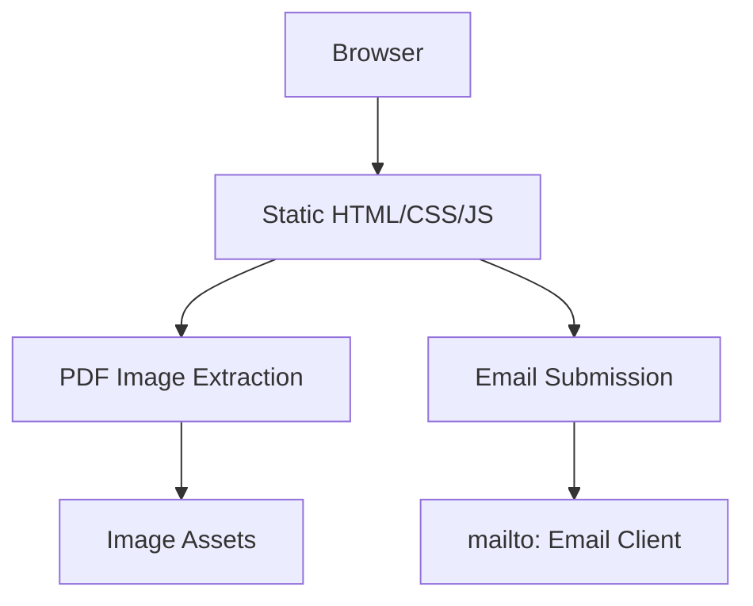
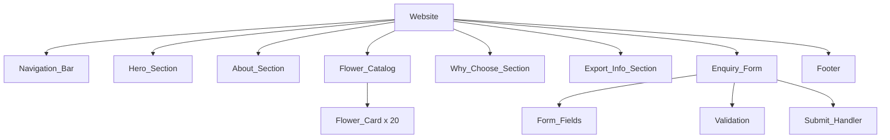

# Design Document: HN Enterprises Flower Website

## Overview

HN Enterprises is a professional Indian floriculture export company that supplies fresh cut flowers and foliage to both domestic buyers within India and international importers overseas. The website (hnEnterprises.com) is a single-page application that showcases 20 flower varieties with images extracted from PDF assets, presents export capabilities, and routes all enquiries to the designated email address (hn.enterpriseexport@gmail.com). The design prioritizes professionalism, visual appeal, and trust-building elements to inspire confidence in both domestic and international buyers, featuring responsive layouts, smooth navigation, a flower catalog with 20 variety cards, and a validated enquiry form with pre-population support.

---

## Architecture

### High-Level Architecture



**Architecture Approach**: Single-page application (SPA) using vanilla HTML, CSS, and JavaScript. No server-side rendering or backend framework required since this is a static marketing/export information site.

**Hosting**: Static file hosting on a CDN or web server supporting standard HTML/CSS/JS delivery.

**Image Source**: PDF files in `d:\hn\flowers_pictures_types\` will be processed to extract individual flower images before deployment.

**Form Handling**: Client-side validation with `mailto:` link submission (simple, reliable, no backend required).

### Component Hierarchy



---

## Component Breakdown

### 1. Navigation Bar

**Purpose**: Persistent header enabling visitors to navigate to key sections with smooth scrolling.

**Interface**:

```pascal
INTERFACE NavigationBar
  Properties:
    - isMobileMenuOpen: Boolean (controls hamburger menu visibility)
    - currentSection: String (currently visible section)
    - navLinks: Array of { label: String, target: String }

  Methods:
    - toggleMobileMenu(): void
    - scrollToSection(targetId: String): void
    - updateCurrentSection(scrollPosition: Number): void

  Event Handlers:
    - onLinkClick(link): smooth scroll to target
    - onHamburgerToggle(): expand/collapse mobile menu
    - onWindowScroll(): update current section highlight
```

**Responsibilities**:
- Display HN Enterprises branding on the left
- Show 6 navigation links (Home, About, Our Flowers, Why Choose Us, Export Info, Contact)
- Handle mobile view (hamburger menu at < 768px)
- Highlight active section based on scroll position
- Smooth scroll to sections (400ms target)

---

### 2. Hero Section

**Purpose**: Full-viewport banner establishing brand identity and providing clear CTAs.

**Interface**:

```pascal
INTERFACE HeroSection
  Properties:
    - backgroundImage: String (CSS URL path)
    - heading: "HN Enterprises"
    - tagline: "Delivering India's Finest Flowers — Across India & Around the World"
    - domain: "hnEnterprises.com"

  Methods:
    - scrollToFlowerCatalog(): void
    - scrollToEnquiryForm(): void

  Event Handlers:
    - onExploreClick(): scroll to flower catalog
    - onEnquiryClick(): scroll to enquiry form
```

**Responsibilities**:
- Full viewport height (100vh)
- Background image covering entire area (CSS object-fit: cover)
- Display primary heading, tagline, and domain
- Two CTA buttons (Explore Our Flowers, Send an Enquiry)
- Sufficient text contrast against background

---

### 3. About Section

**Purpose**: Introduce HN Enterprises as a professional exporter building trust with potential buyers.

**Interface**:

```pascal
INTERFACE AboutSection
  Properties:
    - title: "About Us"
    - companyDescription: String (about HN Enterprises)
    - serviceRange: "Domestic + International"
    - contactEmail: "hn.enterpriseexport@gmail.com"
    - visualElement: String (image or decorative graphic)

  Methods:
    - None (static content display)
```

**Responsibilities**:
- Display "About Us" heading
- Company description as professional floriculture exporter
- Mention domestic and international service capability
- Display contact email (hn.enterpriseexport@gmail.com)
- Include at least one visual element

---

### 4. Flower Catalog

**Purpose**: Display all 20 flower varieties in a responsive grid with visual cards.

**Interface**:

```pascal
INTERFACE FlowerCatalog
  Properties:
    - flowerVarieties: Array of FlowerCardData (20 items)
    - gridColumns: Number (4 desktop, 2 tablet, 1-2 mobile)

  Methods:
    - getCardByVariety(varietyName: String): FlowerCard
    - getCardsByQuery(query: String): Array of FlowerCard
    - scrollToEnquiryFormWithVariety(variety: String): void

  Event Handlers:
    - onCardHover(cardIndex, isHover): apply visual effect
    - onEnquireNowClick(varietyName): pre-populate and scroll to form
```

**FlowerCardData Structure**:

```pascal
STRUCTURE FlowerCardData
  varietyName: String
  imageSource: String (path to extracted image)
  imageAlt: String (variety name for accessibility)
  enquireLinkText: "Enquire Now"
END STRUCTURE
```

**Responsibilities**:
- Display 20 flower cards (exact list from requirements)
- Each card shows variety name and image
- Hover effects (scale, shadow, or overlay)
- Responsive grid layout (4/2/1-2 columns)
- "Enquire Now" button per card
- Pre-populate form when card button clicked
- Image fallback if loading fails

---

### 5. Why Choose Us Section

**Purpose**: Highlight 4 key differentiators with visual tiles to build trust with international buyers.

**Interface**:

```pascal
INTERFACE WhyChooseSection
  Properties:
    - title: "Why Choose HN Enterprises"
    - differentiators: Array of DifferentiatorData (4 items)

  Methods:
    - None (static content display)
```

**DifferentiatorData Structure**:

```pascal
STRUCTURE DifferentiatorData
  title: String
  description: String
  icon: String (CSS class or emoji)
END STRUCTURE
```

**Differentiator List**:
1. Freshness & Quality Assurance
2. Wide Variety (20+ flower types)
3. Domestic & International Shipping
4. Reliable Packaging

**Responsibilities**:
- Display "Why Choose HN Enterprises" heading
- Show 4 differentiator tiles with icons
- Responsive layout (2 columns tablet/desktop, 1 column mobile)

---

### 6. Export Information Section

**Purpose**: Explain shipping capabilities and export process for domestic and international buyers.

**Interface**:

```pascal
INTERFACE ExportInfoSection
  Properties:
    - title: "Export Information"
    - domesticContainer: ContainerData
    - internationalContainer: ContainerData
    - processSteps: Array of ProcessStep (5 items)
    - certificationStatement: String

  Methods:
    - None (static content display)
```

**ContainerData Structure**:

```pascal
STRUCTURE ContainerData
  subHeading: String
  description: String
END STRUCTURE
```

**ProcessStep Structure**:

```pascal
STRUCTURE ProcessStep
  stepNumber: Number (1-5)
  stepName: String
  stepDescription: String
END STRUCTURE
```

**Responsibilities**:
- Display "Export Information" heading (exact match)
- Two separate containers (Domestic / International)
- 5-step export process (Enquiry → Confirmation → Packaging → Dispatch → Delivery)
- Phytosanitary certificate and documentation statement
- Clear distinction between service types

---

### 7. Enquiry Form

**Purpose**: Collect buyer information and route to email with validation and pre-population support.

**Interface**:

```pascal
INTERFACE EnquiryForm
  Properties:
    - fields: Array of FormField (8 required fields)
    - submitButton: "Send Enquiry"
    - emailFallback: "hn.enterpriseexport@gmail.com"
    - successMessage: "Thank you! Your enquiry has been sent. We will respond shortly."
    - errorMessage: "We were unable to send your enquiry. Please contact us directly at hn.enterpriseexport@gmail.com"

  Methods:
    - validateForm(): Boolean
    - validateEmail(email: String): Boolean
    - validatePhone(phone: String): Boolean (min 7 digits, digits only)
    - prepopulateVariety(varietyName: String): void
    - resetForm(): void
    - submitForm(): void

  Event Handlers:
    - onFieldBlur(field): validate individual field
    - onSubmit(event): prevent default, validate, send email
    - onEmailClick(): mailto link
```

**FormField Structure**:

```pascal
STRUCTURE FormField
  id: String
  label: String
  type: String ("text" | "email" | "tel" | "select" | "number" | "textarea")
  required: Boolean
  validationRule: ValidationRule
  errorText: String
  value: String
END STRUCTURE
```

**ValidationRule Structure**:

```pascal
STRUCTURE ValidationRule
  type: "minLength" | "pattern" | "required" | "emailFormat"
  value: Any
  customMessage: String
END STRUCTURE
```

**Responsibilities**:
- 8 required fields (Name, Email, Phone, Country, Flower Variety, Enquiry Type, Quantity, Message)
- Email validation (local-part@domain.tld format)
- Phone validation (digits only, minimum 7 digits)
- Inline error messages for invalid fields
- Success message after valid submission
- Error message for failed submission
- Pre-populate flower variety from card click
- Clear form after successful submission
- Display email fallback for manual contact

---

### 8. Footer

**Purpose**: Display company information, contact details, and navigation links at page bottom.

**Interface**:

```pascal
INTERFACE Footer
  Properties:
    - companyName: "HN Enterprises"
    - domain: "hnEnterprises.com"
    - email: "hn.enterpriseexport@gmail.com"
    - navigationLinks: Array of { label: String, target: String }
    - copyrightText: String (dynamically generated)
    - tagline: "Exporting India's Finest Flowers — Domestically & Internationally"

  Methods:
    - getCurrentYear(): Number
    - generateCopyrightText(): String
```

**Responsibilities**:
- Display company name and domain
- Clickable email link (`mailto:`)
- Navigation links (Home, About, Our Flowers, Export Info, Contact)
- Dynamic copyright with current year
- Tagline displayed in footer

---

## UI Structure

### Desktop Layout (≥ 1024px)

```mermaid
graph LR
    A[Fixed Nav Bar] --> B[Viewport]
    B --> C[Hero (100vh)]
    B --> D[About]
    B --> E[Flower Grid 4 cols]
    B --> F[Why Choose 4 cols]
    B --> G[Export Info 2 cols]
    B --> H[Enquiry Form]
    B --> I[Footer]
```

### Tablet Layout (768px - 1023px)

```mermaid
graph LR
    A[Fixed Nav Bar] --> B[Viewport]
    B --> C[Hero (100vh)]
    B --> D[About]
    B --> E[Flower Grid 2 cols]
    B --> F[Why Choose 2 cols]
    B --> G[Export Info 2 cols]
    B --> H[Enquiry Form]
    B --> I[Footer]
```

### Mobile Layout (< 768px)

```mermaid
graph LR
    A[Hamburger Nav] --> B[Viewport]
    B --> C[Hero (100vh)]
    B --> D[About]
    B --> E[Flower Grid 1-2 cols]
    B --> F[Why Choose 1 col]
    B --> G[Export Info]
    B --> H[Enquiry Form]
    B --> I[Footer]
```

---

## Responsive Design Approach

### Breakpoints

| Breakpoint | Width Range | Grid Columns | Nav Style |
|------------|-------------|--------------|-----------|
| Desktop | ≥ 1024px | 4 (flower), 4 (why choose) | Horizontal |
| Tablet | 768px - 1023px | 2 (flower), 2 (why choose) | Horizontal |
| Mobile | < 768px | 1-2 (flower), 1 (why choose) | Hamburger |

### Grid Implementation

```css
/* Flower Catalog Grid */
.flower-grid {
  display: grid;
  grid-template-columns: repeat(4, 1fr); /* Desktop */
  gap: 20px;
}

@media (max-width: 1023px) {
  .flower-grid {
    grid-template-columns: repeat(2, 1fr); /* Tablet */
  }
}

@media (max-width: 767px) {
  .flower-grid {
    grid-template-columns: repeat(auto-fill, minmax(280px, 1fr)); /* Mobile 1-2 */
  }
}

/* Why Choose Grid */
.why-choose-grid {
  display: grid;
  grid-template-columns: repeat(4, 1fr); /* Desktop */
  gap: 20px;
}

@media (max-width: 1023px) {
  .why-choose-grid {
    grid-template-columns: repeat(2, 1fr); /* Tablet */
  }
}

@media (max-width: 767px) {
  .why-choose-grid {
    grid-template-columns: 1fr; /* Mobile */
  }
}
```

### Mobile Navigation

- Hamburger icon (☰) displayed at < 768px
- Click expands to vertical menu
- Links collapse menu after selection
- Smooth scroll on link click

---

## Form Handling Approach

### Email Submission Strategy

**Approach**: Client-side validation + `mailto:` link submission

**Rationale**:
- Simple, no backend infrastructure required
- Reliable (uses user's default email client)
- Compatible with all browsers
- No CORS or server-side dependencies

**Implementation**:

```pascal
PROCEDURE submitEnquiryForm(formValues)
  INPUT: formValues (object with all form field values)
  OUTPUT: None (triggers email client)
  
  SEQUENCE
    // Step 1: Validate all fields
    IF NOT validateForm(formValues) THEN
      displayValidationErrors(formValues)
      RETURN
    END IF
    
    // Step 2: Compose email content
    emailSubject ← "Flower Enquiry from " + formValues.fullName
    emailBody ← composeEmailBody(formValues)
    
    // Step 3: Open mailto link
    mailtoLink ← "mailto:hn.enterpriseexport@gmail.com"
    mailtoLink ← mailtoLink + "?subject=" + encodeURIComponent(emailSubject)
    mailtoLink ← mailtoLink + "&body=" + encodeURIComponent(emailBody)
    
    // Step 4: Trigger email client
    window.location.href ← mailtoLink
    
    // Step 5: Show success message
    displaySuccessMessage()
    resetForm()
  END SEQUENCE
END PROCEDURE

PROCEDURE composeEmailBody(values)
  INPUT: values (form field values)
  OUTPUT: emailBody (String)
  
  SEQUENCE
    body ← "HN Enterprises Flower Enquiry" + NEWLINE + NEWLINE
    body ← body + "Name: " + values.fullName + NEWLINE
    body ← body + "Email: " + values.email + NEWLINE
    body ← body + "Phone: " + values.phone + NEWLINE
    body ← body + "Country: " + values.country + NEWLINE
    body ← body + "Flower Variety: " + values.flowerVariety + NEWLINE
    body ← body + "Enquiry Type: " + values.enquiryType + NEWLINE
    body ← body + "Quantity: " + values.quantity + " " + values.unit + NEWLINE
    body ← body + NEWLINE + "Message:" + NEWLINE + values.message
    
    RETURN body
  END SEQUENCE
END PROCEDURE
```

**Validation Rules**:

```pascal
PROCEDURE validateEmail(email)
  INPUT: email (String)
  OUTPUT: isValid (Boolean)
  
  RULE: Email must match pattern ^[^\s@]+@[^\s@]+\.[^\s@]+$
END PROCEDURE

PROCEDURE validatePhone(phone)
  INPUT: phone (String)
  OUTPUT: isValid (Boolean)
  
  RULE: Phone must contain only digits AND have length >= 7
END PROCEDURE
```

**Alternative Approaches Considered**:
- **Formspree/Netlify Forms**: Requires account setup, introduces external dependency
- **EmailJS**: Requires API key, JavaScript library dependency
- **Backend API**: Overkill for simple marketing site, requires hosting
- **mailto (chosen)**: No setup, no dependencies, works everywhere

---

## Image Extraction from PDFs

### PDF Processing Workflow

**Input**: 20 PDF files in `d:\hn\flowers_pictures_types\`

**Process**:

```pascal
PROCEDURE extractImagesFromPDFs
  INPUT: None (uses directory d:\hn\flowers_pictures_types\)
  OUTPUT: Extracted images in assets/flowers/
  
  SEQUENCE
    pdfDirectory ← "d:\hn\flowers_pictures_types\"
    outputDirectory ← "assets/flowers/"
    
    // Process each PDF file
    FOR EACH pdfFile IN pdfDirectory DO
      varietyName ← extractVarietyName(pdfFile)
      extractedImage ← extractFirstPageImage(pdfFile)
      outputPath ← outputDirectory + varietyName + ".png"
      
      saveImage(extractedImage, outputPath)
    END FOR
  END SEQUENCE
END PROCEDURE

FUNCTION extractVarietyName(pdfFileName)
  INPUT: pdfFileName (String)
  OUTPUT: varietyName (String)
  
  // Remove .pdf extension and normalize
  varietyName ← replace(pdfFileName, ".pdf", "")
  varietyName ← replace(varietyName, " Floer", " Flower") // fix typo
  varietyName ← replace(varietyName, "  ", " ") // fix double spaces
  RETURN varietyName
END FUNCTION
```

**Output Directory Structure**:

```
assets/
  flowers/
    5 Star Roses.png
    Cocks Comb Flower.png
    Dahlia Flower.png
    Daisies.png
    Dracaena Leaf.png
    Gerbera Flower.png
    Jasmine.png
    Kanchan Flower.png
    Lilly Flower.png
    MARIKOLUNTHU.png
    Mirabel Rose.png
    Mukkutti Flower.png
    Mullai.png
    Orchid Flower.png
    Panneer Rose.png
    Roses.png
    Ruby.png
    Samanthi.png
    Sampangi Flower.png
    Santini.png
```

**Image Extraction Tools**:
- **Option 1**: `pdfimages` (Poppler utilities) - command-line, free
- **Option 2**: ImageMagick - command-line, powerful
- **Option 3**: Python with PyMuPDF - programmatic control
- **Option 4**: Online PDF to image converters - manual but simple

**Recommended**: Python with PyMuPDF for programmatic control and batch processing

**Pre-flight Check**:
Before website deployment, verify:
- All 20 PDF files have corresponding extracted images
- Image filenames match variety names exactly (case-sensitive)
- Images are high quality (minimum 800px width)
- Image format is PNG or JPEG with good compression
- All images have appropriate alt text in HTML

---

## Technology Stack Recommendation

### Core Technologies

| Category | Technology | Rationale |
|----------|------------|-----------|
| **HTML** | HTML5 | Semantic markup, accessibility, SEO |
| **CSS** | CSS3 (Flexbox/Grid) | Responsive layouts, modern styling |
| **JavaScript** | Vanilla ES6+ | No dependencies, lightweight, fast |
| **Images** | PNG/JPEG | Quality for flower imagery, wide browser support |

### Framework/Tools

| Tool | Version | Purpose |
|------|---------|---------|
| **Text Editor** | VS Code | Development environment |
| **Version Control** | Git | Source code management |
| **PDF Extraction** | Python + PyMuPDF | Extract images from PDFs |
| **Image Optimization** | TinyPNG or similar | Compress images without quality loss |

### Recommended Development Tools

```pascal
// File structure
hn-Enterprises-website/
├── index.html              // Main HTML file
├── assets/
│   ├── flowers/           // Extracted flower images (20 files)
│   └── images/            // Hero, decorative images
├── styles/
│   ├── main.css           // Main stylesheet
│   └── responsive.css     // Responsive breakpoints
├── scripts/
│   ├── main.js            // Main application logic
│   └── form.js            // Form validation and submission
├── README.md              // Project documentation
└── pdf-extract.py         // PDF image extraction script
```

### Browser Support

| Browser | Minimum Version | Notes |
|---------|-----------------|-------|
| Chrome | 90+ | Full ES6+ support |
| Firefox | 88+ | Full ES6+ support |
| Edge | 90+ | Chromium-based |
| Safari | 14+ | Full ES6+ support |

### Performance Targets

- **Lighthouse Performance Score**: ≥ 70 (desktop)
- **First Contentful Paint (FCP)**: < 1.8s
- **Time to Interactive (TTI)**: < 3.8s
- **Total Blocking Time (TBT)**: < 200ms
- **Cumulative Layout Shift (CLS)**: < 0.1

---

## Deployment Considerations

### Hosting Options

**Option 1: GitHub Pages**
- **Cost**: Free
- **URL**: hnEnterprises.com (with custom domain)
- **Pros**: Free, simple, Git integration, automatic SSL
- **Cons**: Limited customization, requires GitHub repository

**Option 2: Netlify**
- **Cost**: Free tier available
- **URL**: hnEnterprises.netlify.app (custom domain optional)
- **Pros**: Free SSL, form handling, drag-and-drop deploy
- **Cons**: Free tier has traffic limits

**Option 3: Vercel**
- **Cost**: Free tier available
- **URL**: hnEnterprises.vercel.app (custom domain optional)
- **Pros**: Fast CDN, simple deploy, great DX
- **Cons**: Free tier has limitations

**Option 4: Traditional Hosting**
- **Cost**: ~$5-20/month
- **URL**: hnEnterprises.com
- **Pros**: Full control, custom server config
- **Cons**: Requires server management, manual SSL

**Recommended**: GitHub Pages or Netlify for simplicity and cost

### Deployment Steps

```pascal
PROCEDURE deployWebsite
  INPUT: None
  OUTPUT: Website live at hnEnterprises.com
  
  SEQUENCE
    // Step 1: Prepare files
    buildImageAssets()
    optimizeImages()
    minifyCSSandJS()
    
    // Step 2: Deploy to hosting
    IF using GitHub Pages THEN
      git add .
      git commit -m "Deploy website"
      git push origin main
    ELSE IF using Netlify THEN
      dragAndDropFolderToNetlify()
    END IF
    
    // Step 3: Verify deployment
    checkWebsiteLoads()
    testAllLinks()
    verifyImagesLoad()
    testFormSubmission()
    
    // Step 4: Configure custom domain
    setDNSRecords()
    configureSSL()
    
    // Step 5: Monitor
    set up analytics (optional)
    monitor uptime
  END SEQUENCE
END PROCEDURE
```

### Pre-Deployment Checklist

**Functionality**:
- All navigation links scroll to correct sections (400ms target)
- Form validates all fields correctly
- Form pre-populates from flower cards
- Success/error messages display correctly
- All 20 flower cards display with images
- Responsive layout works at all breakpoints

**Visual**:
- Hero section is full viewport height
- Text contrast sufficient on all backgrounds
- No placeholder text (Lorem Ipsum)
- All images are high quality
- Brand colors consistent throughout

**Accessibility**:
- All images have descriptive alt text
- All form fields have associated labels
- Keyboard navigation works
- Color contrast meets WCAG AA

**Performance**:
- Lighthouse score ≥ 70
- Page load < 3s
- All resources are optimized
- No external dependencies failing

**Testing**:
- Chrome, Firefox, Edge, Safari latest versions
- Mobile, tablet, desktop viewports
- Form submission via email client
- Smooth scrolling performance

### Post-Deployment

**Analytics** (optional but recommended):
- Google Analytics for traffic monitoring
- Event tracking for form submissions
- Page view and scroll depth tracking

**Maintenance**:
- Update copyright year automatically (JavaScript)
- Monitor email inbox (hn.enterpriseexport@gmail.com)
- Update flower catalog if varieties change
- Update images as needed

---

## Design Rationale

### Why This Design Meets Requirements

1. **Single-Page Architecture**: All requirements sections (Hero, About, Catalog, etc.) on one page as specified

2. **Navigation Bar**: Fixed at top, smooth scrolling (400ms), hamburger menu at < 768px, active section highlighting

3. **Responsive Grid**: Flower catalog uses CSS Grid with 4/2/1-2 columns at breakpoints (1024px, 768px, <768px)

4. **Form Handling**: `mailto:` approach chosen for simplicity and reliability - no backend required

5. **PDF Image Extraction**: Python script approach ensures reproducible image extraction from all 20 PDFs

6. **Technology Stack**: Vanilla HTML/CSS/JS chosen for simplicity, speed, and zero dependencies

7. **Email Integration**: Form validates client-side then opens user's email client with pre-composed message

8. **Accessibility**: Semantic HTML, alt text, labels, keyboard navigation all included

9. **Performance**: Minimal code, optimized images, no external libraries ensures fast load times

### Visual Design Direction

**Color Palette**:
- **Primary Green**: #2D6A4F (professional, natural)
- **Secondary Green**: #40916C (highlights, borders)
- **Accent Floral**: #D4A373 (flowers, warmth)
- **Light**: #FAF9F6 (backgrounds)
- **Dark**: #2B2D42 (text, contrast)

**Typography**:
- **Headings**: Playfair Display (serif, elegant) or Montserrat (sans-serif, professional)
- **Body**: Open Sans (readable, neutral)
- **Sizes**: H1=2.5rem, H2=2rem, H3=1.5rem, Body=1rem

**Imagery**:
- High-quality flower photography
- Consistent aspect ratio (4:3 or 1:1)
- Professional lighting and presentation

This design creates a professional, trustworthy appearance that inspires confidence in both domestic Indian and international buyers, meeting all requirements from the requirements document.
